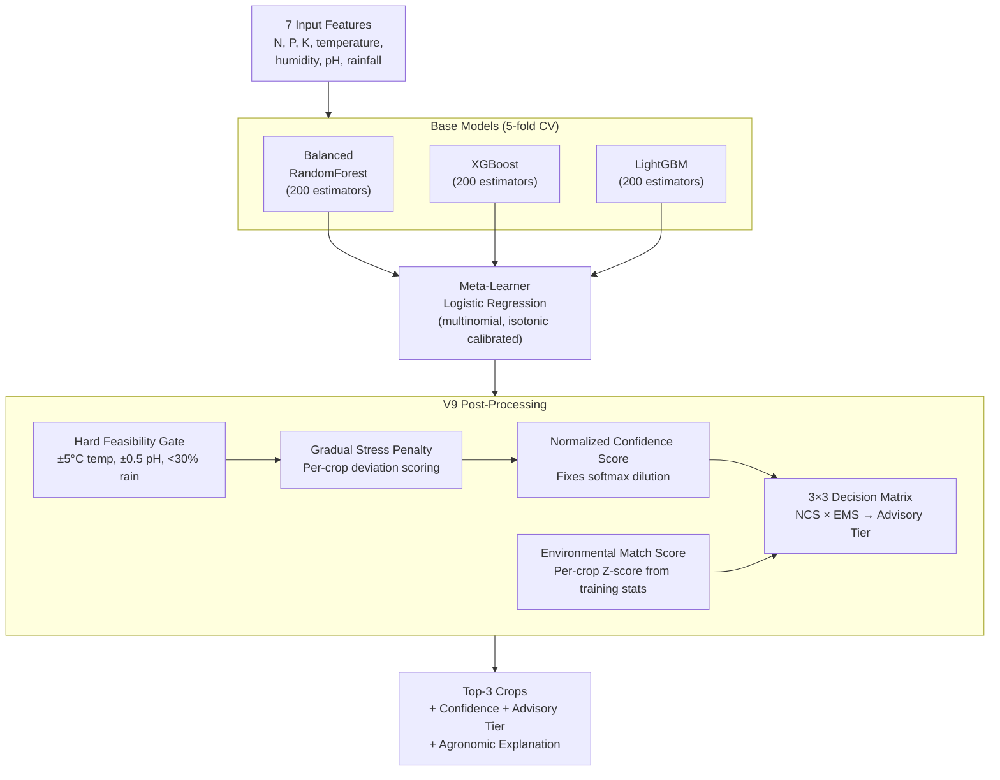

<p align="center">
  
  
  
  
  
  
</p>

<h1 align="center">🤖 CRS ML Engine</h1>

<p align="center">
  <strong>Stacked ensemble ML inference engine — 51 Indian crops, V9 NCS+EMS decision system, deployed on HuggingFace Spaces.</strong>
</p>

---

## 📖 Overview

The CRS ML Engine is a FastAPI-based inference server that powers the crop recommendation system. It uses a **stacked ensemble model** (BalancedRandomForest + XGBoost + LightGBM) trained on 22,300 samples to recommend the top-3 most suitable crops based on soil and climate conditions.

🔗 **Live:** [huggingface.co/spaces/shingala/CRS](https://huggingface.co/spaces/shingala/CRS)

---

## 🧠 Model details

### Architecture — Stacked Ensemble v6



### V9 NCS+EMS decision system

The V9 advisory engine replaces old hard confidence thresholds with two composable metrics:

| Component | Purpose |
|-----------|---------|
| **NCS (Normalized Confidence Score)** | Measures probability above the 1/51 uniform baseline. Fixes softmax dilution where 4% raw probability is actually 2× the expected baseline |
| **EMS (Environmental Match Score)** | Per-crop Z-score from training data statistics (`crop_stats.json`). Measures how well input conditions match the crop's typical growing conditions |
| **Decision Matrix** | 3×3 grid combining NCS confidence level × EMS match level → advisory tier |

#### Decision matrix

| Confidence ↓ \ Environment → | Strong | Acceptable | Weak |
|-------------------------------|--------|------------|------|
| **Strong** | Strongly Recommended | Recommended | Conditional |
| **Moderate** | Recommended | Conditional | Not Recommended |
| **Weak** | Conditional | Not Recommended | Not Recommended |

### Post-processing pipeline

1. **Hard feasibility gate** — Biologically impossible crops excluded (temp ±5°C, pH ±0.5, rainfall <30% min)
2. **Fallback selection** — If all crops excluded, the least-violating crop is selected (capped at 35% confidence)
3. **Gradual stress penalty** — Weighted per-crop deviation scoring across temperature, pH, rainfall, and nutrients
4. **Salinity stress override** — Salt-sensitive crops penalized when pH ≥ 8.8 and rainfall ≥ 2500mm
5. **Confidence caps** — Stress: 75%, Chaos (≥2 severe): 60%, Hard max: 85%
6. **NCS + EMS scoring** — Normalized confidence and environmental match computed
7. **Decision matrix** — Final advisory tier assigned
8. **Limiting factor identification** — The most deviated input feature is flagged
9. **Explanation generation** — Data-driven agronomic explanation for each crop

---

## 🌾 Supported crops (51)

| | | | | |
|---|---|---|---|---|
| Apple | Bajra | Banana | Barley | Ber |
| Blackgram | Brinjal | Carrot | Castor | Chickpea |
| Citrus | Coconut | Coffee | Cole Crop | Cotton |
| Cucumber | Custard Apple | Date Palm | Gourd | Grapes |
| Green Chilli | Groundnut | Guava | Jowar | Jute |
| Kidney Beans | Lentil | Maize | Mango | Mothbeans |
| Mungbean | Muskmelon | Mustard | Okra | Onion |
| Papaya | Pigeonpeas | Pomegranate | Potato | Radish |
| Ragi | Rice | Sapota | Sesame | Soybean |
| Spinach | Sugarcane | Tobacco | Tomato | Watermelon |
| Wheat | | | | |

---

### Input features

| Feature | Unit | Training Range | Description |
|---------|------|----------------|-------------|
| `N` | kg/ha | 0 – 140 | Nitrogen content in soil |
| `P` | kg/ha | 5 – 145 | Phosphorus content in soil |
| `K` | kg/ha | 5 – 205 | Potassium content in soil |
| `temperature` | °C | 8 – 44 | Average temperature |
| `humidity` | % | 14 – 100 | Relative humidity |
| `ph` | — | 3.5 – 10 | Soil pH level |
| `rainfall` | mm | 20 – 300 | Annual rainfall |

### Output

For each prediction request, the engine returns **top-3 crops** with:

- **Crop name** and **confidence score** (%)
- **Advisory tier** — Strongly Recommended / Recommended / Conditional / Not Recommended
- **Match strength** — Strong Match / Moderate Match / Weak Match
- **Risk level** — low / medium / high
- **Agronomic explanation** — Data-driven reasoning for the recommendation
- **Nutritional data** — Protein, fat, carbs, fiber, iron, calcium, vitamins, energy per kg
- **Limiting factor** — The input feature most constraining the recommendation

---

## 🛠️ Tech stack

| Component | Technology |
|-----------|-----------|
| **API Framework** | FastAPI 0.110+ |
| **ML Models** | Scikit-learn (BalancedRandomForest) · XGBoost · LightGBM |
| **Meta-Learner** | Logistic Regression (multinomial, isotonic calibrated) |
| **Calibration** | Temperature scaling (T=0.9) |
| **Data Processing** | NumPy · Pandas |
| **Serialization** | Joblib |
| **Server** | Uvicorn |
| **Container** | Docker (Python 3.11-slim) |

---

## 📁 Folder structure

```
Aiml/
├── app.py                              # FastAPI server — V9 NCS+EMS engine (2100+ lines)
├── predict.py                          # Prediction utilities
├── config.py                           # Configuration constants
├── final_stacked_model.py              # Model training script (Ensemble v6)
├── hybrid_model.py                     # Alternative hybrid model script
│
├── stacked_ensemble_v6.joblib          # Trained stacked ensemble (~254 MB)
├── label_encoder_v6.joblib             # Label encoder for 51 crops
├── stacked_v6_config.joblib            # Model configuration
│
├── Nutrient.csv                        # Nutritional data for 51 crops
├── crop_stats.json                     # Per-crop training statistics (mean, std per feature)
├── feature_ranges.json                 # Feature validation ranges
├── feature_ranges_v6.json              # V6-specific feature ranges
├── calibration_config.json             # Bayesian calibration parameters
├── class_weights.json                  # Class weight configuration
├── drift_report.json                   # Data drift analysis report
├── model_registry.json                 # Model version registry
│
├── training_metadata_v6.json           # V6 training metadata & performance
├── training_metadata.json              # Legacy training metadata
├── metrics_table.json                  # Per-class F1 scores & robustness
├── reliability_metrics.json            # Reliability analysis
├── robustness_report.json              # Noise robustness test results
├── real_world_validation_report.json   # Real-world validation results
│
├── Crop_recommendation.csv             # Original training dataset (ref)
├── Crop_recommendation_synthetic_AplusB.csv  # Augmented dataset (ref)
├── ICRISAT-District_Level_Data.csv     # District-level data reference
├── data_core.csv                       # Core cleaned dataset
│
├── Dockerfile                          # HuggingFace Spaces container
├── requirements.txt                    # Python dependencies
└── logging_config.py                   # Structured logging configuration
```

---

## 🚀 Installation and setup

### Prerequisites

- **Python** ≥ 3.11
- ~**300 MB** disk space for the model file

### 1. Install dependencies

```bash
cd Aiml
pip install -r requirements.txt
```

### 2. Start the inference server

```bash
uvicorn app:app --host 0.0.0.0 --port 7860
```

The API will be available at [http://localhost:7860](http://localhost:7860).

---

## 🔌 API endpoint documentation

### `GET /recommend`

Get crop recommendations for given soil and climate parameters.

**Query parameters:**

| Parameter | Type | Required | Example |
|-----------|------|----------|---------|
| `N` | float | ✅ | `90` |
| `P` | float | ✅ | `42` |
| `K` | float | ✅ | `43` |
| `temperature` | float | ✅ | `24.5` |
| `humidity` | float | ✅ | `68` |
| `ph` | float | ✅ | `6.7` |
| `rainfall` | float | ✅ | `120` |
| `mode` | string | ❌ | `soil` (default) / `extended` / `both` |

**Example request:**

```bash
curl "http://localhost:7860/recommend?N=90&P=42&K=43&temperature=24.5&humidity=68&ph=6.7&rainfall=120"
```

**Response (200):**

```json
{
  "top_3": [
    {
      "crop": "rice",
      "confidence": 78.6,
      "advisory_tier": "Strongly Recommended",
      "match_strength": "Strong Match",
      "risk_level": "low",
      "explanation": "Temperature (24.5C) is within the suitable range...",
      "nutrition": { "protein_g_per_kg": 70, "..." : "..." },
      "ncs": { "ncs": 82.3, "dominance": 3.41, "confidence_level": "strong" },
      "ems": { "ems": 0.723, "match_level": "strong" }
    }
  ],
  "model_info": { "type": "stacked-ensemble-v6", "version": "9.0", "coverage": 51 },
  "diagnostics": { "limiting_factor": "rainfall", "ood_warnings": [], "..." : "..." }
}
```

### `GET /available-crops`

Returns the list of all 51 supported crop names.

### `GET /health`

Returns server health status and model metadata.

---

## 📈 Model performance metrics

### V6 stacked ensemble (current production model)

| Metric | Score |
|--------|-------|
| **Top-1 Accuracy** | 91.46% |
| **Top-3 Accuracy** | 98.86% |
| **Macro F1** | 0.908 |
| **Weighted F1** | 0.914 |
| **ECE (Calibration Error)** | 0.016 → 0.009 (after temperature scaling) |
| **Log Loss** | 0.326 |

### Cross-validation scores (5-fold)

| Base Model | Mean Accuracy | Std Dev |
|------------|--------------|---------|
| BalancedRandomForest | 89.36% | ±0.42% |
| XGBoost | 90.07% | ±0.33% |
| LightGBM | 89.97% | ±0.08% |

### Feature importance

| Feature | Importance |
|---------|-----------|
| K (Potassium) | 17.41% |
| N (Nitrogen) | 16.94% |
| P (Phosphorus) | 13.36% |
| Rainfall | 12.52% |
| Humidity | 10.39% |
| Temperature | 8.63% |
| pH | 8.54% |
| Season | 7.40% |
| Soil Type | 3.06% |
| Irrigation | 1.76% |

### Training details

| Item | Value |
|------|-------|
| **Dataset** | 22,300 samples across 51 crops |
| **Core features** | N, P, K, temperature, humidity, pH, rainfall |
| **Context features** | Season, soil type, irrigation |
| **Folds** | 5-fold stratified cross-validation |
| **Estimators per base** | 200 |
| **Calibration** | Temperature scaling (T=0.9) |

---

## 🧪 Model training guide

### 1. Prepare dataset

Ensure `Crop_recommendation_v2.csv` is present with columns:
`N, P, K, temperature, humidity, ph, rainfall, season, soil_type, irrigation, label`

### 2. Run training

```bash
python final_stacked_model.py
```

This will:
- Train 3 base models (BalancedRF, XGBoost, LightGBM) with 5-fold CV
- Fit a Logistic Regression meta-learner on out-of-fold predictions
- Apply isotonic calibration + temperature scaling
- Save `stacked_ensemble_v6.joblib`, `label_encoder_v6.joblib`, and metadata

### 3. Validate

```bash
python -c "from app import *; print('Model loaded, crops:', len(CROP_AGRO_CONSTRAINTS))"
```

---

## 🚢 Deploy to HuggingFace Spaces

### 1. Create a new HuggingFace Space

- Type: **Docker**
- SDK: Custom

### 2. Push the Aiml directory

```bash
# The Dockerfile exposes port 7860
docker build -t crs-ml .
docker run -p 7860:7860 crs-ml
```

### 3. Required files in the Space

- `Dockerfile` — Builds from `python:3.11-slim`, installs `libgomp1` for LightGBM
- `app.py` — Main FastAPI server
- `stacked_ensemble_v6.joblib` — Trained model (~254 MB, use Git LFS)
- `label_encoder_v6.joblib`, `stacked_v6_config.joblib` — Model config
- All `.json` and `.csv` data files

### Dockerfile

```dockerfile
FROM python:3.11-slim
WORKDIR /app
RUN apt-get update && apt-get install -y --no-install-recommends libgomp1 && rm -rf /var/lib/apt/lists/*
COPY requirements.txt ./requirements.txt
RUN pip install --no-cache-dir --upgrade -r requirements.txt
COPY Aiml ./Aiml
COPY app.py ./app.py
EXPOSE 7860
CMD ["python", "-m", "uvicorn", "app:app", "--host", "0.0.0.0", "--port", "7860"]
```

---

## 📚 Related docs

| Document | Description |
|----------|-------------|
| [Root README](../README.md) | Project overview, architecture, quick start guide |
| [Frontend README](../Frontend/README.md) | React UI setup, i18n guide, component architecture |
| [Backend README](../Backend/app/README.md) | API endpoints, Django setup, environment configuration |

---

<p align="center">
  Part of the <strong>Crop Recommendation System</strong> · Built by <strong>Henil Shingala</strong>
</p>
