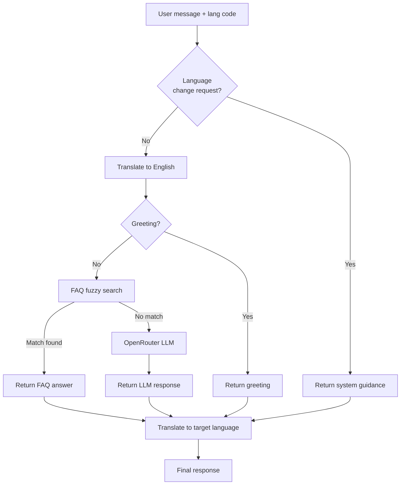

<p align="center">
  
  
  
  
  
</p>

<h1 align="center">⚙️ CRS Backend API</h1>

<p align="center">
  <strong>Django REST Framework API gateway — connects the React frontend to the ML engine, government schemes database, and AI chatbot assistant.</strong>
</p>

---

## 📖 Overview

The CRS Backend serves as the central API gateway for the Crop Recommendation System. It:

- **Proxies ML predictions** to the HuggingFace-hosted ML engine and enriches results with crop metadata, images, and nutritional data
- **Serves 831 government agriculture schemes** with multilingual search and filtering
- **Powers the AI chatbot** (Krishi Mitra) with a hybrid FAQ-search + OpenRouter LLM pipeline
- **Logs all predictions** for analytics and debugging

🔗 **Live:** [crop-recomandation-system-kcoh.onrender.com](https://crop-recomandation-system-kcoh.onrender.com/)

---

## 🔌 API endpoints

### 🌾 Prediction

#### `POST /api/predict/`

Get AI-powered crop recommendations.

**Request body:**

```json
{
  "N": 90,
  "P": 42,
  "K": 43,
  "temperature": 24.5,
  "humidity": 68,
  "ph": 6.7,
  "rainfall": 120,
  "mode": "soil",
  "soil_type": 1,
  "irrigation": 0,
  "moisture": 43.5
}
```

| Parameter | Type | Required | Description |
|-----------|------|----------|-------------|
| `N` | float | ✅ | Nitrogen content in soil (kg/ha) |
| `P` | float | ✅ | Phosphorus content in soil (kg/ha) |
| `K` | float | ✅ | Potassium content in soil (kg/ha) |
| `temperature` | float | ✅ | Temperature (°C) |
| `humidity` | float | ✅ | Relative humidity (%) |
| `ph` | float | ✅ | Soil pH (0–14) |
| `rainfall` | float | ✅ | Rainfall (mm) |
| `mode` | string | ❌ | Model mode: `soil` (default), `extended`, `both` |
| `soil_type` | int | ❌ | 0=sandy, 1=loamy, 2=clay, 3=silty, 4=peaty |
| `irrigation` | int | ❌ | 0=rainfed, 1=irrigated |
| `moisture` | float | ❌ | Soil moisture (%) |

**Response (200):**

```json
{
  "mode": "soil",
  "top_1": {
    "crop": "rice",
    "confidence": 78.6,
    "advisory_tier": "Strongly Recommended",
    "risk_level": "low",
    "explanation": "Temperature (24.5C) is within the suitable range...",
    "image_urls": ["..."],
    "nutrition": { "protein_g_per_kg": 70, "energy_kcal_per_kg": 3650, "..." : "..." }
  },
  "top_3": [ "..." ],
  "model_info": { "coverage": 51, "type": "stacked-ensemble-v6", "version": "9.0" }
}
```

---

### 🏛️ Government schemes

#### `GET /api/schemes/`

Fetch paginated, filtered government agriculture schemes.

| Parameter | Type | Default | Description |
|-----------|------|---------|-------------|
| `language` | string | `en` | Language code (22 supported) |
| `state` | string | — | Filter by state name |
| `category` | string | — | Filter by scheme category |
| `keyword` | string | — | Search keyword in title/description |
| `farmer_type` | string | — | Filter by farmer type |
| `income_level` | string | — | Filter by income level |
| `land_size` | string | — | Filter by land holding size |
| `page` | int | `1` | Page number |
| `per_page` | int | `1000` | Results per page (max 1500) |

#### `GET /api/schemes/options/`

Returns available filter options (states and categories).

---

### 🤖 AI Assistant

#### `POST /api/assistant/chat/`

Send a message to the AI chatbot assistant.

**Request body:**

```json
{
  "message": "What is the best soil for rice?",
  "lang": "hi"
}
```

| Parameter | Type | Required | Description |
|-----------|------|----------|-------------|
| `message` | string | ✅ | User's question |
| `lang` | string | ❌ | Target response language code (default: `en`) |

**Response (200):**

```json
{
  "answer": "चावल के लिए सबसे अच्छी मिट्टी...",
  "source": "faq",
  "confidence": 0.892
}
```

The `source` field indicates: `faq` (FAQ knowledge base), `llm` (OpenRouter LLM), `greeting`, or `system`.

---

### 📊 Utility endpoints

| Method | Endpoint | Description |
|--------|----------|-------------|
| `GET` | `/api/health/` | System health check (DB + ML status) |
| `GET` | `/api/crops/available/?mode=soil` | List ML model's supported crops |
| `GET` | `/api/model/limits/` | Feature validation ranges (shared source of truth) |
| `GET` | `/api/crops/` | List all crops with metadata |
| `GET` | `/api/crops/{id}/` | Get specific crop details |
| `GET` | `/api/logs/` | Prediction logs (admin only) |

---

## 🛠️ Tech stack

| Component | Technology |
|-----------|-----------|
| **Framework** | Django 5.x · Django REST Framework 3.15 |
| **Database** | SQLite (production-ready for this scale) |
| **Cache** | Redis (optional, falls back to LocMemCache) |
| **Static Files** | WhiteNoise (compressed static serving) |
| **WSGI Server** | Gunicorn (2 workers, 120s timeout) |
| **Security** | HSTS · CSRF · CORS allowlist · Rate limiting · Input validation |
| **ML Gateway** | HuggingFace Spaces HTTP client |
| **AI/NLP** | OpenRouter (LLM) · NLLB (translation) · FAQ fuzzy search |

---

## 📁 Folder structure

```
Backend/
└── app/
    ├── app/                        # Django project configuration
    │   ├── settings.py             # Production settings (security, CORS, caching)
    │   ├── urls.py                 # Root URL routing → /api/
    │   └── wsgi.py                 # WSGI entry point for Gunicorn
    │
    ├── apps/                       # Main application
    │   ├── models.py               # Crop, PredictionLog models
    │   ├── views.py                # All API view handlers
    │   ├── urls.py                 # API route definitions
    │   ├── serializers.py          # DRF serializers
    │   ├── validators.py           # Secure input validation (Pydantic-style)
    │   ├── ml_inference.py         # HuggingFace gateway client
    │   ├── nutrition.py            # Nutritional data CSV lookup
    │   ├── middleware.py           # Rate limiting middleware
    │   ├── admin.py                # Django admin configuration
    │   ├── services/
    │   │   ├── scheme_service.py   # Multilingual schemes search & filter
    │   │   ├── faq_search.py       # FAQ tokenization + fuzzy matching
    │   │   ├── hf_service.py       # HuggingFace Spaces API client
    │   │   ├── openrouter_client.py # OpenRouter LLM integration
    │   │   ├── translator.py       # NLLB translation + language detection
    │   │   └── crop_sync.py        # Crop metadata synchronization
    │   ├── management/commands/    # Custom Django management commands
    │   ├── migrations/             # Database migrations
    │   └── data/                   # Static data files
    │
    ├── Ai/                         # AI chatbot knowledge base
    │   └── Ai.json                 # Crop Q&A pairs (multilingual)
    │
    ├── media/                      # Uploaded crop images
    ├── staticfiles/                # Collected static assets
    ├── db.sqlite3                  # SQLite database
    ├── manage.py                   # Django management CLI
    ├── requirements.txt            # Python dependencies
    └── .env.example                # Environment variable template
```

---

## 🚀 Installation and setup

### Prerequisites

- **Python** ≥ 3.11
- **pip** or **pipenv**

### 1. Install dependencies

```bash
cd Backend/app
pip install -r requirements.txt
```

### 2. Configure environment

```bash
cp .env.example .env
```

Edit `.env` with your configuration:

| Variable | Required | Default | Description |
|----------|----------|---------|-------------|
| `DJANGO_SECRET_KEY` | ✅ | — | Django secret key (auto-generated on Render) |
| `DJANGO_DEBUG` | ❌ | `False` | Enable debug mode (`True` / `False`) |
| `DJANGO_ALLOWED_HOSTS` | ❌ | `localhost,127.0.0.1,.onrender.com` | Comma-separated allowed hosts |
| `CORS_ALLOWED_ORIGINS` | ❌ | `http://localhost:5173,...` | Comma-separated frontend origins |
| `HF_MODEL_URL` | ❌ | `https://shingala-crs.hf.space` | HuggingFace ML Space URL |
| `HF_TOKEN` | ❌ | — | HuggingFace token (if space is private) |
| `REDIS_URL` | ❌ | — | Redis URL for caching (falls back to LocMemCache) |
| `SCHEMES_JSON_PATH` | ❌ | Auto-detected | Path to multilingual schemes JSON |

### 3. Run migrations and seed data

```bash
python manage.py migrate
python manage.py seed_crops        # Populate crop metadata
python manage.py sync_crops        # Sync crop images from GitHub
```

### 4. Start the development server

```bash
python manage.py runserver
```

The API will be available at [http://localhost:8000/api/](http://localhost:8000/api/).

---

## 🗄️ Database models

### Crop

| Field | Type | Description |
|-------|------|-------------|
| `name` | CharField (unique) | Crop name matching ML model labels |
| `expected_yield` | CharField | Yield per hectare (e.g., "2-3 tons/hectare") |
| `season` | CharField | Growing season (Kharif / Rabi / Zaid) |
| `description` | TextField | Brief crop description |
| `image`, `image_2`, `image_3` | ImageField | Uploaded crop images (3 slots) |
| `image_url`, `image_2_url`, `image_3_url` | URLField | External image URLs |
| `created_at`, `updated_at` | DateTimeField | Timestamps |

### PredictionLog

| Field | Type | Description |
|-------|------|-------------|
| `nitrogen`, `phosphorus`, `potassium` | FloatField | NPK input values |
| `temperature`, `humidity`, `ph`, `rainfall` | FloatField | Climate inputs |
| `moisture` | FloatField (optional) | Soil moisture (%) |
| `soil_type` | IntegerField (optional) | Sandy=0, Loamy=1, Clay=2, Silty=3, Peaty=4 |
| `irrigation` | IntegerField (optional) | Rainfed=0, Irrigated=1 |
| `mode` | CharField | Model mode used |
| `model_version` | CharField | ML model version |
| `predictions` | JSONField | Top-3 prediction results |
| `ip_address` | GenericIPAddressField | Client IP |
| `created_at` | DateTimeField | Timestamp |

---

## 🏛️ Multilingual schemes system

The backend serves **831 government agriculture schemes** from a single 31 MB JSON file (`agriculture_schemes_multilingual.json`):

- Schemes are pre-translated into all **22 supported languages**
- The `scheme_service.py` handles filtering, search, and pagination
- Search works on both title and description fields in the selected language
- Filter options (states, categories) are dynamically extracted from the dataset

---

## 🤖 AI assistant architecture



All processing happens in English internally. Translation to the user's language occurs **once** at the final step via NLLB.

---

## 🚢 Deploy to Render

The project includes a `render.yaml` blueprint for one-click deployment:

### 1. Connect your GitHub repository to [Render](https://render.com)

### 2. Create a new Web Service with these settings:

| Setting | Value |
|---------|-------|
| **Root Directory** | `Backend/app` |
| **Runtime** | Python 3.11 |
| **Build Command** | `pip install -r requirements.txt && python manage.py collectstatic --noinput` |
| **Start Command** | `python manage.py migrate --noinput && python manage.py seed_crops && python manage.py sync_crops && gunicorn app.wsgi:application --bind 0.0.0.0:$PORT --workers 2 --timeout 120` |

### 3. Set environment variables:

- `DJANGO_SECRET_KEY` — Render can auto-generate this
- `DJANGO_DEBUG` = `False`
- `HF_MODEL_URL` = `https://shingala-crs.hf.space`
- `CORS_ALLOWED_ORIGINS` = Your frontend URL

---

## 📚 Related docs

| Document | Description |
|----------|-------------|
| [Root README](../../README.md) | Project overview, architecture, quick start guide |
| [Frontend README](../../Frontend/README.md) | React UI setup, i18n guide, component architecture |
| [ML Engine README](../../Aiml/README.md) | Model details, training guide, performance metrics |

---

<p align="center">
  Part of the <strong>Crop Recommendation System</strong> · Built by <strong>Henil Shingala</strong>
</p>
