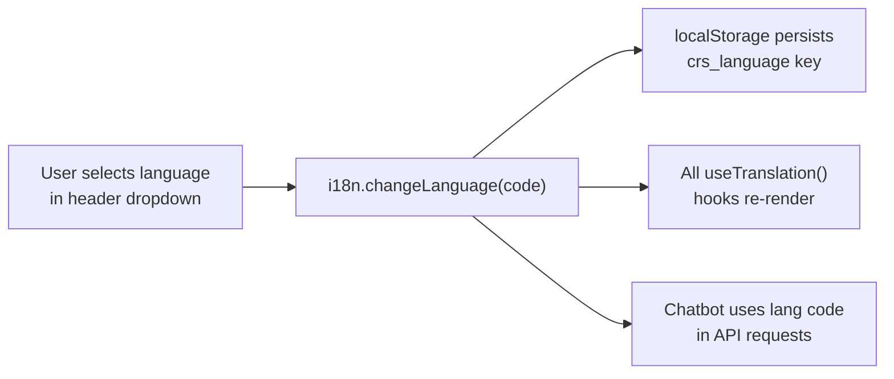
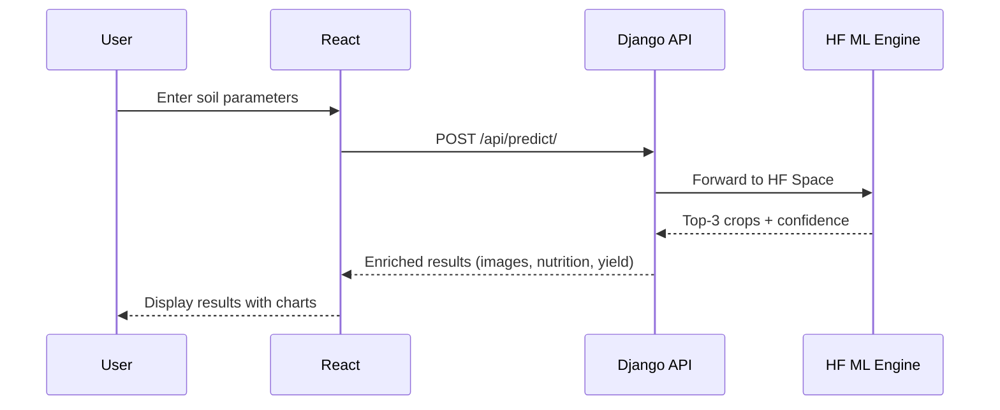

<p align="center">
  
  
  
  
  
  
</p>

<h1 align="center">🖥️ CRS Frontend</h1>

<p align="center">
  <strong>React + TypeScript single-page application for the Crop Recommendation System — responsive, multilingual, and production-ready.</strong>
</p>

---

## 📖 Overview

The CRS Frontend is a modern web application that provides farmers and agricultural stakeholders with an intuitive interface to:

- Enter soil and climate parameters for **AI-powered crop recommendations**
- Browse **831 government agriculture schemes** with multilingual search
- Interact with **Krishi Mitra**, an AI chatbot assistant for farming queries
- View **7-day weather forecasts** for any Indian village, district or city
- Switch between **22 Indian languages** seamlessly

🔗 **Live:** [crop-recomandation-system.vercel.app](https://crop-recomandation-system.vercel.app/)

---

## ✨ Features

### 🌾 Crop recommendation UI
- 7-parameter input form (N, P, K, temperature, humidity, pH, rainfall)
- Top-3 crop results with confidence scores, advisory tiers, and explanations
- Nutritional data visualization with animated progress bars
- Crop image carousel for each recommendation

### 🌍 22 Indian language switcher
Instant language switching for the entire application:

| Code | Language | Code | Language | Code | Language |
|------|----------|------|----------|------|----------|
| `en` | English | `hi` | Hindi | `gu` | Gujarati |
| `mr` | Marathi | `pa` | Punjabi | `ta` | Tamil |
| `te` | Telugu | `kn` | Kannada | `bn` | Bengali |
| `or` | Odia | `as` | Assamese | `brx` | Bodo |
| `doi` | Dogri | `gom` | Konkani | `ks` | Kashmiri |
| `mai` | Maithili | `ml` | Malayalam | `mni` | Manipuri |
| `ne` | Nepali | `sa` | Sanskrit | `sat` | Santali |
| `sd` | Sindhi | `ur` | Urdu | | |

### 🏛️ Government schemes browser
- Search and filter **831 schemes** by state, category, farmer type, income level, and land size
- Full scheme details rendered in the user's selected language

### 🤖 AI chatbot widget
- Floating chat widget (Krishi Mitra 🌱)
- Context-aware responses about crops and farming practices
- Automatic response translation to the selected language

### 📱 Responsive design
- Mobile-first responsive layout
- Dark/light theme support via `next-themes`
- Smooth animations powered by Motion (Framer Motion)

---

## 🛠️ Tech stack

| Category | Technologies |
|----------|-------------|
| **Framework** | React 18.3 · TypeScript · Vite 6.3 |
| **Styling** | Tailwind CSS 4.1 · tw-animate-css |
| **UI Components** | Radix UI (20+ primitives) · Lucide Icons · shadcn/ui · MUI |
| **Charting** | Recharts 2.15 |
| **Animation** | Motion 12.23 (Framer Motion) |
| **i18n** | i18next 25.x · react-i18next 16.x |
| **Forms** | react-hook-form 7.55 |
| **HTTP Client** | Axios (via services layer) |
| **Build** | Vite 6.3 · PostCSS |

---

## 📁 Folder structure

```
Frontend/
├── src/
│   ├── app/
│   │   ├── App.tsx                     # Root application component
│   │   ├── components/
│   │   │   ├── InputForm.tsx           # 7-parameter crop input form
│   │   │   ├── ResultsSection.tsx      # Crop results display with charts
│   │   │   ├── SchemesRecommendation.tsx  # Government schemes browser
│   │   │   ├── ChatWidget.tsx          # AI chatbot floating widget
│   │   │   ├── ErrorBoundary.tsx       # React error boundary
│   │   │   ├── figma/                  # Design components
│   │   │   └── ui/                     # Reusable UI primitives (shadcn)
│   │   ├── hooks/                      # Custom React hooks
│   │   ├── services/                   # API integration (axios clients)
│   │   └── utils/                      # Utility functions
│   ├── locales/                        # 22 language JSON translation files
│   │   ├── en.json                     # English (base)
│   │   ├── hi.json                     # Hindi
│   │   ├── gu.json                     # Gujarati
│   │   └── ... (22 files total)
│   ├── styles/                         # Global CSS stylesheets
│   ├── i18n.ts                         # i18next initialization & config
│   └── main.tsx                        # Application entry point
├── index.html                          # HTML template
├── package.json                        # Dependencies & scripts
├── vite.config.ts                      # Vite configuration
├── tsconfig.json                       # TypeScript configuration
├── postcss.config.mjs                  # PostCSS plugins
├── vercel.json                         # Vercel deployment config
├── .env.example                        # Environment template
└── guidelines/                         # Design guidelines
```

---

## 🚀 Installation and setup

### Prerequisites

- **Node.js** ≥ 18
- **npm** or **pnpm**

### Install dependencies

```bash
cd Frontend
npm install
```

### Configure environment

```bash
cp .env.example .env
```

Edit `.env` with your backend API URL:

```env
# Required: Backend API base URL (no trailing slash)
VITE_API_BASE_URL=http://localhost:8000/api

# Optional: API key when backend has API_KEYS configured
# VITE_API_KEY=your-api-key
```

| Variable | Required | Description |
|----------|----------|-------------|
| `VITE_API_BASE_URL` | ✅ | Backend API base URL. Use `http://localhost:8000/api` for local dev or the production Render URL |
| `VITE_API_KEY` | ❌ | Optional API key if the backend enforces key-based authentication |

### Start development server

```bash
npm run dev
```

The app will be available at [http://localhost:5173](http://localhost:5173).

---

## 📜 Available scripts

| Script | Command | Description |
|--------|---------|-------------|
| **Dev** | `npm run dev` | Start Vite dev server with HMR |
| **Build** | `npm run build` | Create optimized production build in `dist/` |
| **Type Check** | `npm run type-check` | Run TypeScript compiler without emitting (for CI) |

---

## 🌐 i18n guide — how language switching works

### Architecture



### How it works

1. **Initialization** — `src/i18n.ts` loads all 22 language JSON files and initializes i18next with the user's saved preference (or defaults to English)
2. **Language persistence** — The selected language code is stored in `localStorage` under the key `crs_language`
3. **Component translation** — Components use `useTranslation()` hook from `react-i18next` to access translated strings
4. **Chatbot integration** — When the user sends a message, the current language code is passed as the `lang` parameter so the backend translates responses

### Adding a new language

1. Create a new JSON file in `src/locales/` (e.g., `xx.json`) using `en.json` as a template
2. Import it in `src/i18n.ts` and add to the `resources` object
3. Add the language option to the language dropdown component

---

## 🔌 API integration guide

The frontend communicates with the Django backend through a services layer:

### Key API endpoints used

| Action | Method | Endpoint | Description |
|--------|--------|----------|-------------|
| Predict crops | `POST` | `/api/predict/` | Send soil parameters, receive top-3 recommendations |
| Get schemes | `GET` | `/api/schemes/` | Fetch filtered government schemes |
| Get filter options | `GET` | `/api/schemes/options/` | Fetch available states and categories |
| Chat with assistant | `POST` | `/api/assistant/chat/` | Send message + lang code, receive translated response |
| Get available crops | `GET` | `/api/crops/available/` | Fetch list of ML model's supported crops |
| Model limits | `GET` | `/api/model/limits/` | Fetch feature validation ranges for form inputs |
| Health check | `GET` | `/api/health/` | Verify backend and ML service status |

### Request flow



---

## 🚢 Build and deploy to Vercel

### 1. Build for production

```bash
npm run build
```

The output will be in the `dist/` directory.

### 2. Deploy to Vercel

The project includes a `vercel.json` configuration:

```json
{
  "rewrites": [
    { "source": "/(.*)", "destination": "/index.html" }
  ]
}
```

**Deploy steps:**
1. Push your code to GitHub
2. Connect the repository to [Vercel](https://vercel.com)
3. Set the **Root Directory** to `Frontend`
4. Add the environment variable `VITE_API_BASE_URL` pointing to your production backend
5. Deploy — Vercel will automatically run `npm run build`

---

## 📚 Related docs

| Document | Description |
|----------|-------------|
| [Root README](../README.md) | Project overview, architecture, quick start guide |
| [Backend README](../Backend/README.md) | API endpoints, Django setup, environment configuration |

---

## 🔄 Changelog

### V10.0.0 — 2026-03-25 (Current)
- Fixed TypeScript `any` in `WeatherDashboard` catch block → `unknown` with type guard
- Fixed variable shadowing inside `hourlyTimes.forEach` (renamed `t` → `ts`)
- Removed `console.error` from chat error handler (no stack trace leakage in prod)
- Moved `react`/`react-dom` from `peerDependencies` to `dependencies`
- Removed Windows-incompatible `postinstall` chmod script
- Added `npm run type-check` script
- Added `src/version.ts` as single source of truth for version string
- Renamed package from `@figma/my-make-file` → `crop-recommendation-system`

---

<p align="center">
  Part of the <strong>Crop Recommendation System</strong> · Built by <strong>Henil Shingala</strong>
</p>