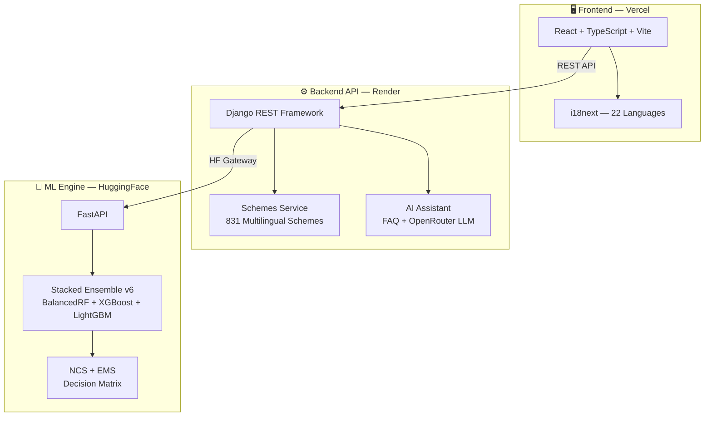

<p align="center">
  
  
  
  
  
  
  
  
</p>

<h1 align="center">🌾 Crop Recommendation System (CRS)</h1>

<p align="center">
  <strong>AI-powered crop advisory platform for Indian agriculture — supporting 51 crops, 831 government schemes, and 22 Indian languages.</strong>
</p>

---

## 🔗 Live demo

| Service | URL |
|---------|-----|
| 🌐 **Frontend** | [crop-recomandation-system.vercel.app](https://crop-recomandation-system.vercel.app/) |
| ⚙️ **Backend API** | [crop-recomandation-system.onrender.com](https://crop-recomandation-system.onrender.com/) |
| 🤖 **ML Engine** | [huggingface.co/spaces/shingala/CRS](https://huggingface.co/spaces/shingala/CRS) |
| 📦 **Source Code** | [github.com/Henilshingala/crop-recomandation-system](https://github.com/Henilshingala/crop-recomandation-system) |

---

## 🏗️ System architecture



---

## ✨ Features

### 🌱 Crop recommendation
- **51 crop coverage** — from staples (rice, wheat) to cash crops (cotton, sugarcane) and fruits (mango, apple)
- **7 soil & climate inputs** — N, P, K, temperature, humidity, pH, rainfall
- **Top-3 ranked results** with confidence scores, advisory tiers, and agronomic explanations
- **V9 NCS+EMS decision matrix** — Normalized Confidence Score + Environmental Match Score for accurate advisories
- **Hard feasibility gates** — biologically impossible crops are excluded before ranking
- **Nutritional data** — per-crop protein, fat, carbs, fiber, iron, calcium, and vitamin content

### 🌍 22 Indian language support

All UI text, scheme descriptions, and chatbot responses are available in:

| | | | |
|---|---|---|---|
| 🇬🇧 English (`en`) | 🇮🇳 Hindi (`hi`) | 🇮🇳 Gujarati (`gu`) | 🇮🇳 Marathi (`mr`) |
| 🇮🇳 Punjabi (`pa`) | 🇮🇳 Tamil (`ta`) | 🇮🇳 Telugu (`te`) | 🇮🇳 Kannada (`kn`) |
| 🇮🇳 Bengali (`bn`) | 🇮🇳 Odia (`or`) | 🇮🇳 Assamese (`as`) | 🇮🇳 Bodo (`brx`) |
| 🇮🇳 Dogri (`doi`) | 🇮🇳 Konkani (`gom`) | 🇮🇳 Kashmiri (`ks`) | 🇮🇳 Maithili (`mai`) |
| 🇮🇳 Malayalam (`ml`) | 🇮🇳 Manipuri (`mni`) | 🇮🇳 Nepali (`ne`) | 🇮🇳 Sanskrit (`sa`) |
| 🇮🇳 Santali (`sat`) | 🇮🇳 Sindhi (`sd`) | 🇮🇳 Urdu (`ur`) | |

### 🏛️ Government schemes browser
- **831 agriculture schemes** from central and state governments
- Filter by **state, category, farmer type, income level, and land size**
- Full scheme details in the user's selected language

### 🤖 AI chatbot assistant (Krishi Mitra)
- **Hybrid FAQ + LLM architecture** — fast FAQ matching with OpenRouter LLM fallback
- Crop-specific Q&A knowledge base
- Automatic response translation via NLLB model

### 📊 Multilingual FAQ system
- Tokenization, stopword removal, and fuzzy matching
- Unmatched questions logged for future training

---

## 🛠️ Tech stack

| Layer | Technologies |
|-------|-------------|
| **Frontend** | React 18.3 · TypeScript · Vite 6.3 · Tailwind CSS 4.1 · i18next · Radix UI · Recharts · Motion · Lucide Icons |
| **Backend** | Django 5.x · Django REST Framework · SQLite · Redis (optional) · WhiteNoise · Gunicorn |
| **ML Engine** | Python 3.11 · FastAPI · Scikit-learn · XGBoost · LightGBM · NumPy · Pandas · Joblib |
| **DevOps** | Docker · Render (Backend) · Vercel (Frontend) · HuggingFace Spaces (ML) · GitHub Actions |

---

## 📁 Project structure

```
CRS/
├── Frontend/                   # React + TypeScript SPA
│   ├── src/
│   │   ├── app/
│   │   │   ├── components/     # ChatWidget, InputForm, ResultsSection, SchemesRecommendation
│   │   │   ├── hooks/          # Custom React hooks
│   │   │   ├── services/       # API integration layer
│   │   │   └── utils/          # Utility functions
│   │   ├── locales/            # 22 language JSON files
│   │   ├── styles/             # Global stylesheets
│   │   └── i18n.ts             # i18next configuration
│   ├── package.json
│   ├── vite.config.ts
│   └── vercel.json
│
├── Backend/
│   └── app/
│       ├── app/                # Django project settings
│       │   ├── settings.py     # Production-ready configuration
│       │   ├── urls.py         # Root URL routing
│       │   └── wsgi.py         # WSGI entry point
│       ├── apps/               # Main Django application
│       │   ├── models.py       # Crop, PredictionLog models
│       │   ├── views.py        # All API endpoint handlers
│       │   ├── urls.py         # API route definitions
│       │   ├── serializers.py  # DRF serializers
│       │   ├── validators.py   # Input validation
│       │   ├── ml_inference.py # HuggingFace gateway client
│       │   ├── nutrition.py    # Nutritional data lookup
│       │   └── services/       # FAQ search, HF service, OpenRouter, Translator, Scheme service
│       ├── Ai/                 # AI chatbot data (Ai.json)
│       └── manage.py
│
├── Aiml/                       # ML inference engine
│   ├── app.py                  # FastAPI server (2100+ lines, V9 engine)
│   ├── predict.py              # Prediction utilities
│   ├── final_stacked_model.py  # Model training script
│   ├── stacked_ensemble_v6.joblib  # Trained model (~254 MB)
│   ├── Nutrient.csv            # Nutritional data for 51 crops
│   ├── crop_stats.json         # Per-crop training statistics
│   ├── feature_ranges.json     # Feature validation ranges
│   ├── calibration_config.json # Bayesian calibration parameters
│   ├── Dockerfile              # HuggingFace Spaces container
│   └── requirements.txt
│
├── agriculture_schemes_multilingual.json  # 831 schemes in 22 languages (~31 MB)
├── Dockerfile                  # Root Docker config
├── render.yaml                 # Render deployment blueprint
├── app.py                      # Root FastAPI proxy
└── requirements.txt
```

---

## 🚀 Quick start

### Prerequisites

- **Node.js** ≥ 18 · **Python** ≥ 3.11 · **Git**

### 1. Clone the repository

```bash
git clone https://github.com/Henilshingala/crop-recomandation-system.git
cd crop-recomandation-system
```

### 2. Start the ML engine

```bash
cd Aiml
pip install -r requirements.txt
uvicorn app:app --host 0.0.0.0 --port 7860
```

### 3. Start the backend

```bash
cd Backend/app
pip install -r requirements.txt
cp .env.example .env          # Edit with your secrets
python manage.py migrate
python manage.py seed_crops
python manage.py runserver
```

### 4. Start the frontend

```bash
cd Frontend
npm install
cp .env.example .env          # Set VITE_API_BASE_URL
npm run dev
```

Open [http://localhost:5173](http://localhost:5173) in your browser.

---

## 📸 Screenshots

> _Screenshots coming soon — visit the [live demo](https://crop-recomandation-system.vercel.app/) to explore the application._

---

## 🤝 Contributing

Contributions are welcome! Here is how you can help:

1. **Fork** the repository
2. **Create** a feature branch: `git checkout -b feature/amazing-feature`
3. **Commit** your changes: `git commit -m "Add amazing feature"`
4. **Push** to the branch: `git push origin feature/amazing-feature`
5. **Open** a Pull Request

### Development guidelines

- Follow existing code style and conventions
- Write descriptive commit messages
- Update documentation for any API changes
- Test all changes locally before submitting a PR

---

## 📄 License

This project is licensed under the **MIT License** — see the [LICENSE](LICENSE) file for details.

---

## 📚 Related docs

| Document | Description |
|----------|-------------|
| [Frontend README](Frontend/README.md) | React UI setup, i18n guide, component architecture |
| [Backend README](Backend/app/README.md) | Django API endpoints, environment config, deployment |
| [ML Engine README](Aiml/README.md) | Model architecture, training guide, performance metrics |

---

<p align="center">
  Built with ❤️ by <strong>Henil Shingala</strong>
</p>
