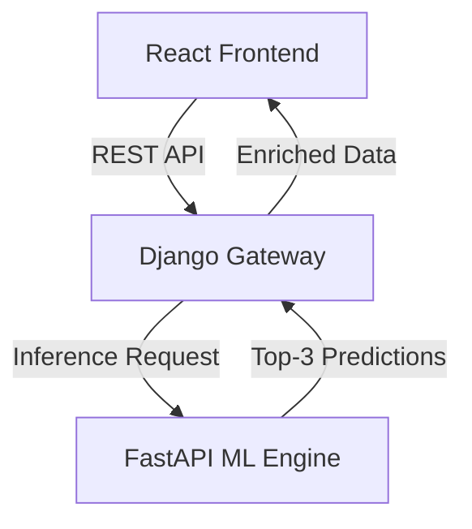

# 🌾 Crop Recommendation System


An intelligent, full-stack agricultural decision support system that recommends the most suitable crops based on soil composition and climate parameters.

## 🚀 Live Demo

- **Web Frontend**: [https://crop-recomandation-system.vercel.app/](https://crop-recomandation-system.vercel.app/)
- **API Gateway (Render)**: [https://crop-recomandation-system.onrender.com/](https://crop-recomandation-system.onrender.com/)
- **ML Engine (HuggingFace)**: [https://huggingface.co/spaces/shingala/CRS](https://huggingface.co/spaces/shingala/CRS)

---

## 🏗️ System Architecture

The project follows a **decoupled gateway architecture** to ensure high availability and scalability within free-tier resource limits.



### 1. ⚛️ Frontend ([Vite](https://vitejs.dev/) + [React](https://react.dev/))
- Modern, responsive UI with **Tailwind CSS**.
- Real-time prediction visualization.
- Interactive crop cards with nutritional data.
- Built using **TypeScript** for robust type safety.

### 2. 🐍 Backend Gateway ([Django](https://www.djangoproject.com/))
- Acts as a secure intermediary between the UI and ML models.
- **REST Framework** for API endpoints.
- Prediction logging and analytics.
- Zero-ML dependency (routes all inference requests to external engine).

### 3. 🤖 ML Engine ([FastAPI](https://fastapi.tiangolo.com/))
- **Stacked Ensemble Model** (Version 3.0).
- High-performance inference server.
- Bayesian calibration for confidence scores.
- Hosted on HuggingFace Spaces.

---

## 🛠️ Tech Stack

| Layer | Technologies |
|-------|--------------|
| **Frontend** | React, Tailwind CSS, Framer Motion, pnpm |
| **Backend** | Django, Django REST Framework, SQLite |
| **ML/Inference** | Python, FastAPI, Scikit-learn, XGBoost, LightGBM |
| **DevOps** | Docker, Git, Render, Vercel, HuggingFace |

---

## 📦 Project Structure

```text
.
├── Aiml/           # Machine Learning models and training scripts
├── Backend/        # Django REST API gateway
├── Frontend/       # React application source
├── requirements.txt # HuggingFace deployment dependencies
├── Dockerfile      # HuggingFace container config (V3)
└── app.py          # HuggingFace entrypoint wrapper
```

---

## 🚀 Getting Started

To run the entire system locally:

1. **Clone the repository**:
   ```bash
   git clone https://github.com/Henilshingala/crop-recomandation-system.git
   cd crop-recomandation-system
   ```

2. **Run the ML Engine**:
   ```bash
   cd Aiml
   pip install -r requirements.txt
   python app.py
   ```

3. **Run the Backend Gateway**:
   ```bash
   cd Backend/app
   pip install -r requirements.txt
   python manage.py runserver
   ```

4. **Launch the Frontend**:
   ```bash
   cd Frontend
   pnpm install
   pnpm dev
   ```

---

## 📄 License

Distributed under the MIT License. See `LICENSE` for more information.

---

**Developed with ❤️ for Sustainable Agriculture.**
